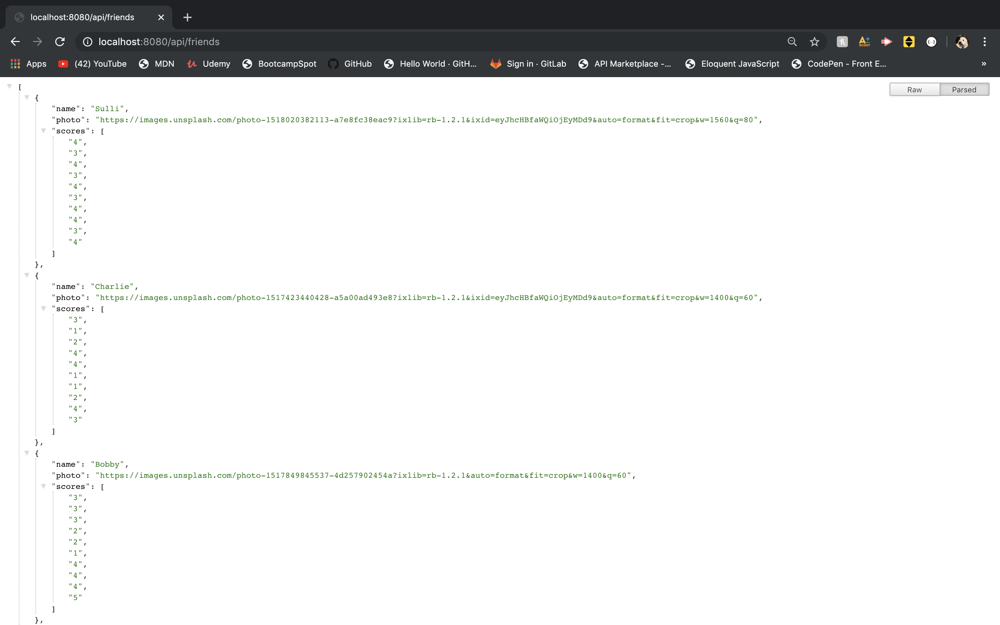

# friend-finder for dogs
## Take the survey to find a new friend for your dog

## Technology Used
These must be installed to use friend-finder
- HTML
- Bootstrap
- JavaScript
- [Node.js](https://nodejs.org/en/)
- [npm](https://www.npmjs.com/get-npm), including [express](https://www.npmjs.com/package/express), [body-parser](https://www.npmjs.com/package/body-parser), and [path].
- [dotenv npm package](https://www.npmjs.com/package/dotenv)

### localhost:8080/

### localhost:8080/survey

### localhost:8080/api/friends

